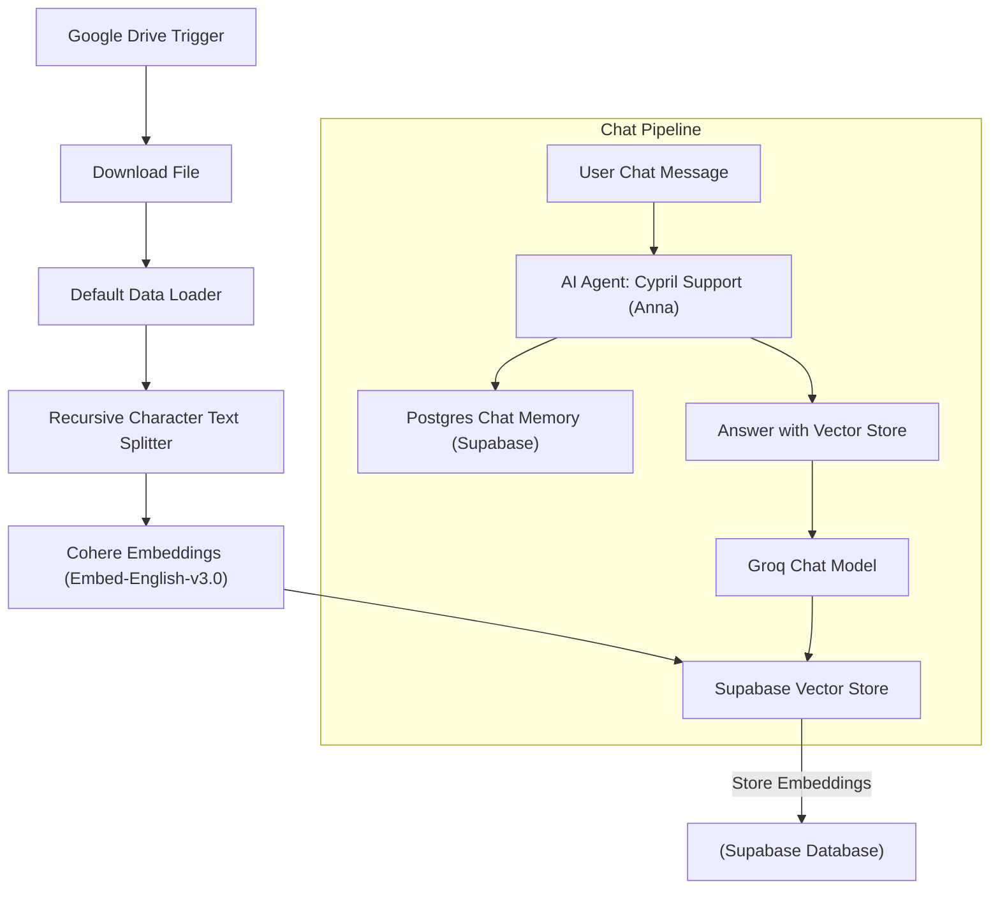
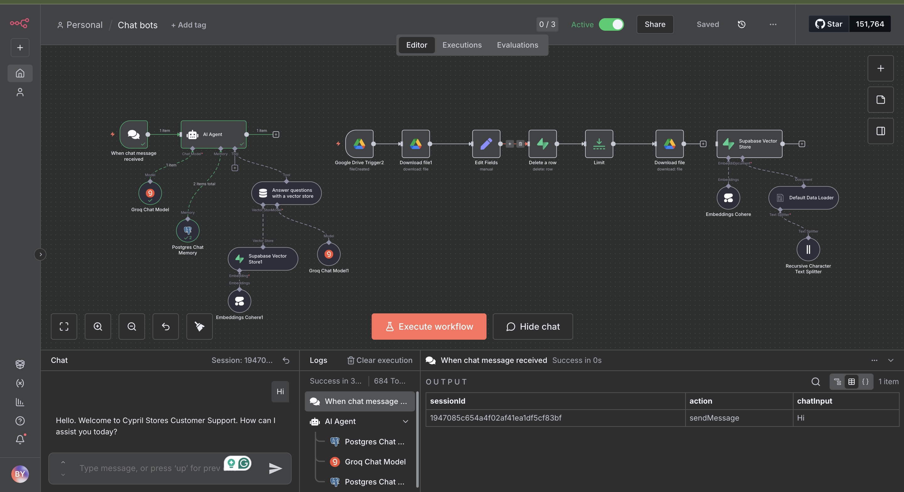
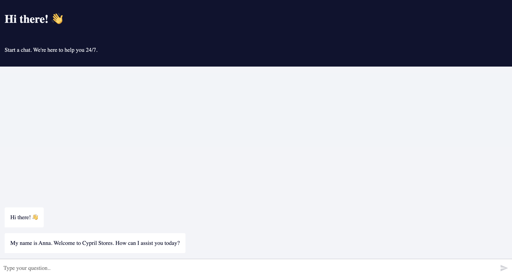
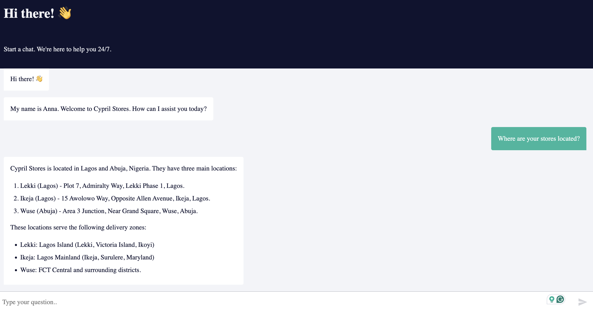

## Cypril Stores RAG (Retrieval Augmented Generation) Chatbot - Anna Bot

**Cypril Stores RAG Chatbot (Anna)** is an AI-powered customer assistant designed to handle customer inquiries for **Cypril Stores** — a retail chain with branches in **Lagos** and **Abuja**, Nigeria.

The chatbot leverages a **Retrieval-Augmented Generation (RAG)** pipeline built using **n8n**, **Supabase**, **Cohere**, and **Groq** to deliver accurate, context-aware responses sourced directly from verified Cypril Stores business documentation.

---

  


## 🚀 Key Features

- 💬 **Conversational AI:** Built with the **Groq Chat Model** for fast and natural reasoning.  
- 🧾 **Knowledge-Grounded Responses:** Retrieves data from **Supabase Vector Store** for accurate answers.  
- 🧩 **Vector Embeddings:** Uses **Cohere Embed-English-v3.0 (1024 Dimensions)** for semantic understanding.  
- 🧠 **Postgres Chat Memory:** Persists user conversations in **Supabase** (`n8n_chat_histories` table).  
- ⚡ **Automated Knowledge Updates:** Automatically retrains the knowledge base when a new business document is uploaded to Google Drive.  
- 🔒 **RAG Integrity:** Responses strictly limited to verified store data — eliminating hallucinations.  
- 🌐 **Production Deployment:** End users interact via a public chat interface powered by **n8n**.

---

## 🧩 Architecture Overview




| Tool                                  | Purpose                             |
| ------------------------------------- | ----------------------------------- |
| **n8n**                               | Automation & workflow orchestration |
| **Supabase**                          | Database + vector storage for RAG   |
| **Cohere Embed-English-v3.0 (1024D)** | Text embeddings                     |
| **Groq Chat Model**                   | Fast LLM inference for reasoning    |
| **PostgreSQL**                        | Memory storage (chat histories)     |
| **Google Drive**                      | Document upload trigger             |
| **pgvector**                          | Vector similarity search in SQL     |


🧮 Supabase Setup
<details> <summary>📜 Click to view SQL setup script</summary>

```sql
-- Enable pgvector extension
CREATE EXTENSION vector;

-- Create table to store document embeddings
CREATE TABLE documents (
  id BIGSERIAL PRIMARY KEY,
  content TEXT,
  metadata JSONB,
  embedding VECTOR(1024)
);

-- Function to perform similarity search
CREATE FUNCTION match_documents (
  query_embedding VECTOR(1024),
  match_count INT DEFAULT NULL,
  filter JSONB DEFAULT '{}'
)
RETURNS TABLE (
  id BIGINT,
  content TEXT,
  metadata JSONB,
  similarity FLOAT
)
LANGUAGE plpgsql
AS $$
#variable_conflict use_column
BEGIN
  RETURN QUERY
  SELECT
    id,
    content,
    metadata,
    1 - (documents.embedding <=> query_embedding) AS similarity
  FROM documents
  WHERE metadata @> filter
  ORDER BY documents.embedding <=> query_embedding
  LIMIT match_count;
END;
$$;
```
</details>





<br>

⚙️ Workflow Configuration (n8n)

🔹 1. Document Processing Segment

Trigger: Google Drive → File Created/ Added

Embedding Batch Size: 200

Embedding Model: Cohere embed-english-v3.0 (1024D)

Text Splitter: Chunk Size = 1000, Overlap = 200

Destination: Supabase Vector Store → documents table

<br>
<br><br>


🔹 2. Chatbot Reasoning Segment

Model: Groq Chat Model

Memory: Postgres Chat Memory (n8n_chat_histories)

Context Window Length: 10

AI Agent Name: Anna (Cypril Stores Customer Support)


<br>
<br>

🧠 System Prompt

*You are "Cypril Stores Customer Support," a helpful, polite, and professional AI assistant.
Your primary role is to answer customer inquiries about Cypril Stores' locations, operating hours,
pricing, policies, and services.*

*Core Rules:*
*1. Use only information from the Supabase RAG data.*

*2. Cypril Stores operates in Lagos and Abuja, Nigeria. Prices are in Naira (₦).*

*3. If unsure, respond with:*

    "I apologise, but I do not have that specific information in my current records. 
    Please contact customer service at support@cyprilstores.ng for assistance."
    
*4. Maintain a warm, professional tone at all times.*


<br>
<br>

🔹 3. Vector Retrieval Segment

Node: “Answer Questions with a Vector Store”

Description: 
*"Detailed information regarding Cypril Stores’ locations (Lagos and Abuja), business hours, product pricing, delivery policy, return policy, and loyalty program details."*

Limit: 15

Vector Source: Supabase Vector Store → documents table

Connected Model: Groq Chat Model

<br>

#### 🧾 Business Knowledge Base

The model’s knowledge base is derived from Cypril Stores’ internal business document, covering:

🏬 Store locations, hours, and contacts (Lagos & Abuja)

🛒 Product categories, unit prices, and special offers

🚚 Delivery, return, and refund policies

🎁 Loyalty program: Cypril Rewards Club

📞 Manager contacts and operational notes


💬 Example Chat Flow

User:

Hi, what are your operating hours at the Wuse branch?

Anna:

The Wuse (Abuja) branch operates daily from 8:00 AM to 8:00 PM.
You can reach the store at 080-CYPRIL-A.


🧠 Memory Example

Anna retains the last 10 exchanges per user session using n8n_chat_histories stored in Supabase PostgreSQL, ensuring context-aware and seamless interactions.


<br>
<br>

🌍 Deployment

Platform: n8n Cloud

Access: Chatbot accessible via a custom chat URL

First Message:

Hi there! 👋
My name is Anna. Welcome to Cypril Stores. How can I assist you today?



<br>
<br>
📸 Visuals
🧠 Workflow Snapshot



<br>

💬 Chatbot Demo

🎥 Watch Full Demo (Video)

▶️ [Watch Demo Video](https://drive.google.com/file/d/10tVfV7U84uPMFgEjf2QDb03o13hIOUoh/view)


<br>
<br>

🧩 Future Improvements

🔗 Integrate live inventory data via Cypril’s internal API

💬 Add sentiment analysis for customer feedback

🌐 Enable multilingual support (English + Yoruba)

📱 Deploy to WhatsApp or web chat widget using n8n Webhook

📚 References

n8n Documentation

Supabase Vector Database

Cohere Embeddings API

Groq AI Models

👩🏽‍💻 Author

Bayonle Yusuff

Data & Automation Analyst | AI Workflow Developer


